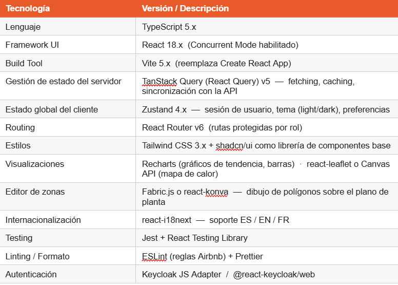
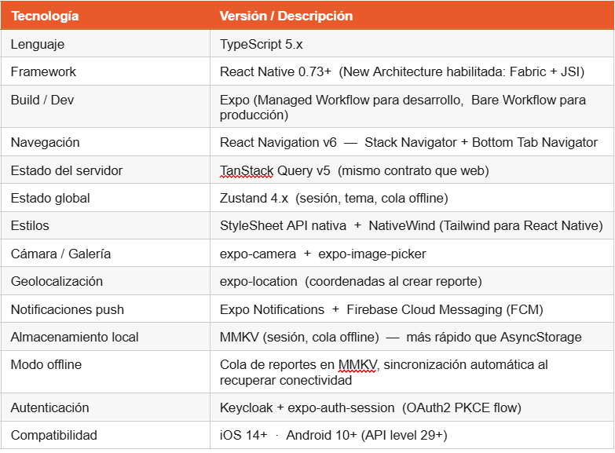

# Sistema de Gestión de riesgos en faenas

**Descripción del proyecto**

El proyecto consiste en la creación de un sistema  integral para la gestión de riesgos faenas. Para contextualizar, existen muchos entornos de trabajo en que los trabajadores están expuestos a riesgos que puedan dañar su integridad, generalmente riesgos físicos. Pueden ser varios escenarios, como inundaciones, cortes de luz, incendios, derrame de químicos, incluso asaltos. Para poder registrar estos incidentes, lo que hace el trabajador que trabaja en esos entornos es registrar los hechos a mano. Es decir, los reportes que ellos elaboran lo realizan a papel, ya sea en blanco o con un formato de reporte otorgado por la empresa. Una vez hecho el reporte, el trabajador debe enviarlo a su correspondiente supervisor (presencialmente) para que éste pueda analizar el caso y resolverlo. 
¿Cuál es el problema con esto? Que todo este proceso consume tiempo, requiere logística y que la trazabilidad no es del todo seguro. Asimismo, el proceso descrito depende de objetos fisicos como los registros en papel, y no hay una base de datos que albergue dichos registros, y a la vez, consultar, actualizar, seleccionar o eliminar. Al haber dependencia de objetos físicos, ello requiere salvaguardarlos de una forma más engorrosa, y al acumularse con el tiempo, resulta más dificil consultar en un futuro un determinado reporte.

## Características Principales

### Módulos Funcionales 

- **Reporte de Peligros de Seguridad**: Los trabajadores pueden reportar actos inseguros y condiciones inseguras mediante fotografías, ubicación geográfica y descripciones detalladas.

- **Seguimiento de Estado en Tiempo Real**: Permite monitorear el estado de un reporte durante todo su ciclo de vida (enviado → en revisión → acción asignada → cerrado).

- **Monitoreo de SLA**: Indicadores visuales que muestran si los reportes están dentro del plazo, en riesgo de incumplimiento o vencidos.

- **Estadísticas Personales de Seguridad**: Permite visualizar tasas de efectividad, rachas de participación y métricas relacionadas con el reporte de Incidentes y Actos Peligrosos (IAP).

- **Notificaciones**: Los usuarios reciben alertas en tiempo real sobre cambios en el estado de sus reportes y avisos de seguridad específicos de su área de trabajo.

- **Soporte Offline**: Los reportes se almacenan localmente cuando no hay conexión a Internet y se sincronizan automáticamente una vez que se restablece la conectividad.

### Funcionalidades Adicionales

- **Integración con IAP**: Gestión especializada para reportes de IAP (Incidentes y Actos Peligrosos u Oportunidades de Mejora, según la definición de la organización).
- **Acciones Correctivas**: Permite asignar, monitorear y dar seguimiento a acciones correctivas, incluyendo fechas límite y estado de cumplimiento.
- **Comentarios y Discusión**: Facilita la colaboración entre los miembros del equipo mediante comentarios asociados a cada reporte.
- **Clasificación Jerárquica de Reportes**: Los reportes pueden clasificarse como actos inseguros o condiciones inseguras para mejorar su análisis y tratamiento.
- **Soporte para Múltiples Turnos**: Permite registrar incidentes y observaciones correspondientes a turnos de mañana, tarde o noche.
- **Tema Industrial Oscuro**: Interfaz diseñada específicamente con una temática oscura y acentos en color naranja de seguridad, optimizando la visibilidad y la experiencia de uso en entornos industriales.

## Stack Tecnológico <detallar el stack tecnológico utilizado>

### Backend

- 
- 
- 
- 

### Frontend (Página web)

### Frontend (App móvil)
 

### Base de Datos
- La solución propuesta utiliza Cloud Firestore como sistema de gestión de bases de datos. Firestore es una base de datos NoSQL orientada a documentos que forma parte del ecosistema de Google Cloud Platform (GCP). Su adopción responde a la necesidad de contar con una plataforma altamente escalable, capaz de soportar grandes volúmenes de reportes de seguridad, actualizaciones en tiempo real y una arquitectura basada en servicios desacoplados.

Una de las principales ventajas de Firestore es su capacidad de escalamiento horizontal automático, permitiendo aumentar la capacidad del sistema sin requerir configuraciones manuales de infraestructura. Esto resulta especialmente relevante para una aplicación de gestión de riesgos laborales, donde el volumen de reportes puede variar significativamente según la cantidad de empresas, faenas y usuarios conectados.

Adicionalmente, Firestore ofrece integración nativa con servicios de Google Cloud, simplificando los mecanismos de autenticación y autorización mediante cuentas de servicio utilizadas por los microservicios desplegados en Cloud Run. Asimismo, dispone de soporte para operaciones asíncronas a través del SDK oficial de Python, facilitando su integración con servicios desarrollados en FastAPI y ejecutados mediante Uvicorn.

La plataforma también incorpora capacidades de sincronización en tiempo real mediante listeners, permitiendo que los cambios en los reportes, alertas o acciones correctivas se reflejen instantáneamente en las interfaces de usuario sin necesidad de consultas periódicas al servidor.

## Modelos de Datos

La estructura de Firestore se organiza utilizando un esquema jerárquico basado en colecciones y subcolecciones. En el nivel superior se encuentra la colección clients, donde cada documento representa una organización cliente del sistema. Este enfoque permite implementar un modelo multi-tenant, asegurando la separación lógica de los datos entre distintas empresas.

Dentro de cada cliente se almacenan diversas subcolecciones que representan las entidades funcionales del sistema:

- users: contiene la información de los usuarios registrados, incluyendo nombre, correo electrónico, rol, áreas asignadas y estado.
- zones: almacena información de las zonas o áreas de trabajo, incluyendo procesos asociados, colores de visualización y coordenadas utilizadas para representar polígonos en mapas de planta.
- reports: registra los reportes de riesgos, actos inseguros, condiciones inseguras e IAP, junto con información sobre responsables, fotografías, turnos y estado del reporte.
- report_events: mantiene un historial completo de cambios de estado, implementando un enfoque de auditoría basado en eventos.
- actions: almacena las acciones correctivas derivadas de los reportes, incluyendo responsables, fechas de vencimiento y estado de cumplimiento.
- comments: permite registrar conversaciones y comentarios asociados a cada reporte.
- alerts: administra las notificaciones y alertas generadas por el sistema.
- exports: conserva el historial de exportaciones de información y reportes generados por los usuarios.

Este diseño favorece la organización lógica de los datos, reduce la complejidad de las consultas y facilita la escalabilidad de la plataforma.

## Seguridad

La arquitectura propuesta incorpora un conjunto de controles de seguridad diseñados para proteger la confidencialidad, integridad y disponibilidad de la información gestionada por el sistema. Estos controles se aplican tanto a nivel de infraestructura como de aplicación, siguiendo buenas prácticas recomendadas para entornos cloud y arquitecturas basadas en microservicios.

**Seguridad en las Comunicaciones**

Todo el tráfico entre clientes, servicios y componentes de la plataforma se realiza mediante el protocolo HTTPS utilizando TLS 1.3. Esta configuración garantiza que la información transmitida viaje cifrada y protegida frente a interceptaciones o ataques de tipo "man-in-the-middle". Adicionalmente, la infraestructura impide conexiones HTTP en entornos de producción, asegurando que todas las comunicaciones utilicen canales seguros.

**Autenticación entre Servicios**

Los distintos microservicios de la plataforma se autentican mediante Service Accounts administradas por Google Cloud Platform. Para ello se utiliza Workload Identity Federation, mecanismo que permite validar la identidad de los servicios sin necesidad de almacenar credenciales o contraseñas dentro del código fuente. Esta estrategia reduce significativamente la superficie de ataque asociada a la gestión de secretos.

**Principio de Mínimos Privilegios**

Cada componente del sistema dispone únicamente de los permisos estrictamente necesarios para ejecutar sus funciones. Este enfoque limita el impacto potencial de una vulnerabilidad o acceso no autorizado. Por ejemplo, los servicios encargados de generar exportaciones son los únicos que poseen permisos de escritura sobre los repositorios de almacenamiento destinados a reportes y documentos.

**Validación de Entradas**

Toda la información ingresada por los usuarios es validada antes de ser procesada por la lógica de negocio. Para ello se emplean modelos de validación definidos mediante Pydantic, verificando tipos de datos, formatos y restricciones de contenido. Esta medida ayuda a prevenir errores de procesamiento, inconsistencias de datos y diversos tipos de ataques basados en entradas maliciosas.

**Auditoría y Trazabilidad**

El sistema mantiene registros estructurados de las acciones realizadas por los usuarios y servicios. Operaciones como creación, modificación, actualización de estados y asignación de acciones correctivas generan eventos de auditoría que incluyen información como identificador de usuario, organización cliente, fecha, hora, acción ejecutada y resultado obtenido. Estos registros permiten realizar análisis posteriores, investigaciones y procesos de cumplimiento normativo.

**Control de Acceso mediante CORS**

La API implementa políticas CORS (Cross-Origin Resource Sharing) para restringir el acceso únicamente a los dominios autorizados del frontend web y la aplicación móvil. En ambientes de desarrollo se permite el acceso desde localhost para facilitar las pruebas, mientras que en producción se aplican restricciones más estrictas para evitar solicitudes provenientes de orígenes no autorizados.

**Protección contra Abuso y Sobrecarga**

La plataforma incorpora mecanismos de limitación de solicitudes (Rate Limiting) para reducir riesgos asociados a ataques de fuerza bruta, automatización maliciosa y consumo excesivo de recursos. Se establecen límites por dirección IP y se aplican controles más estrictos en operaciones sensibles, como los procesos de autenticación.

**Protección de Datos Sensibles**

Las evidencias fotográficas asociadas a incidentes y reportes se consideran información sensible y no se exponen públicamente. El acceso a estos recursos se realiza mediante URLs firmadas generadas dinámicamente por el backend, con tiempos de expiración limitados. De esta manera se garantiza que únicamente usuarios autorizados puedan visualizar el contenido durante un período controlado.

**Beneficios de la Estrategia de Seguridad**

La combinación de cifrado de comunicaciones, autenticación basada en identidades de servicio, validación de datos, auditoría centralizada y control granular de permisos permite construir una plataforma alineada con las buenas prácticas de seguridad modernas. Esta estrategia contribuye a proteger la información operacional de las organizaciones, asegurar la trazabilidad de las acciones realizadas y reducir los riesgos asociados a accesos no autorizados o manipulaciones de datos.

## Integrantes

**CAPSTONE_001D - Grupo 1**

- Sean Parker
- Tomás Figueroa
- Cristóbal Zapata

## Documentación Adicional <especificar la documentación adicional que se incorpora, abajo son ejemplos>

- **ERS**
- **Diagrama de Clases**
- **Modelo de Datos**
- **Carta Gantt**

## Arquitectura <especificar la arquitectura de la solución, abajo son ejemplos>

El sistema sigue una **arquitectura en capas**:

- **Capa de Presentación**: Next.js con componentes React
- **Capa de Controladores**: Express routes y controllers
- **Capa de Servicios**: Lógica de negocio y validaciones
- **Capa de Datos**: Sequelize ORM con PostgreSQL
- **Capa de Auditoría**: Triggers de base de datos para trazabilidad

**Visión General de la Arquitectura**

La solución propuesta corresponde a una arquitectura distribuida de múltiples capas orientada a servicios, diseñada para soportar la gestión de riesgos e incidentes de Seguridad y Salud Ocupacional (SSO). La arquitectura se basa en una separación clara entre la capa de presentación, la capa de servicios de negocio y la capa de datos, permitiendo escalabilidad, mantenibilidad y facilidad de integración con futuros sistemas.

La capa de presentación está compuesta por aplicaciones cliente web y móvil, desarrolladas para permitir el acceso al sistema desde distintos dispositivos. Estas aplicaciones consumen funcionalidades a través de APIs expuestas por los servicios backend.

La capa de servicios implementa una arquitectura de microservicios, donde cada servicio posee responsabilidades específicas y se comunica mediante interfaces REST. Este enfoque favorece el desacoplamiento funcional, la independencia de despliegue y la escalabilidad de cada componente.

Finalmente, la capa de datos utiliza una base de datos NoSQL basada en Cloud Firestore para el almacenamiento de información operacional y Cloud Storage para la gestión de archivos binarios, tales como fotografías, planos y documentos adjuntos.

La autenticación y autorización son delegadas a un proveedor de identidad externo mediante Keycloak, permitiendo una administración centralizada de usuarios, roles y permisos.

**Capas de la Arquitectura**

La arquitectura se encuentra organizada en las siguientes capas:

**1)Capa de Clientes**

Corresponde a las aplicaciones utilizadas por los usuarios finales para interactuar con el sistema. Está conformada por:

- Aplicación Web Administrativa desarrollada en React.

- Aplicación Móvil desarrollada en React Native para dispositivos Android e iOS.

Estas aplicaciones permiten registrar riesgos, gestionar incidentes, revisar indicadores, generar reportes y recibir alertas operacionales.

**Capa de API Gateway**

Actúa como punto único de entrada hacia los servicios backend.

Sus principales responsabilidades son:

- Autenticación mediante JWT.

- Enrutamiento de solicitudes.

- Terminación de conexiones HTTPS.
  
- Control de acceso basado en roles.
- 
- Aplicación de políticas de seguridad.

**Capa de Microservicios**

La lógica de negocio se encuentra distribuida en múltiples microservicios especializados:

Microservicio	Responsabilidad Principal
auth-service	Gestión de autenticación, validación de tokens y control de acceso.
reports-service	Administración de reportes de actos y condiciones inseguras.
incidents-service	Gestión completa del ciclo de vida de incidentes y acciones correctivas.
zones-service	Administración de zonas, áreas operativas y gemelos digitales de planta.
alerts-service	Generación y seguimiento de alertas automáticas y manuales.
dashboard-service	Procesamiento de indicadores, mapas de calor y métricas de desempeño.
export-service	Generación de exportaciones en formatos PDF, XLSX y CSV.

Cada microservicio posee su propio ciclo de despliegue y expone interfaces REST independientes, permitiendo evolucionar cada componente sin afectar al resto del sistema.

Capa de Datos

La persistencia de información se encuentra compuesta por:

Cloud Firestore como base de datos principal.
Cloud Storage para almacenamiento de archivos binarios.
Colecciones y subcolecciones estructuradas por organización cliente.

Esta organización permite implementar un modelo multiempresa (multi-tenant), garantizando aislamiento lógico de los datos entre organizaciones.

Capa de Observabilidad

La plataforma incorpora mecanismos de monitoreo y trazabilidad mediante:

Cloud Logging.
Cloud Monitoring.
Error Reporting.

Estas herramientas permiten supervisar el comportamiento de los servicios, detectar errores y analizar el rendimiento operacional del sistema.

Capa CI/CD

El proceso de integración y despliegue continuo considera:

Cloud Build para compilación automatizada.
Artifact Registry para almacenamiento de imágenes de contenedores.
Cloud Run para despliegue de servicios.

Esta estrategia permite realizar actualizaciones frecuentes con mínimos tiempos de indisponibilidad.

**Principios de Diseño Arquitectónico**

La arquitectura se diseñó siguiendo una serie de principios fundamentales:

**API-First**

Toda la funcionalidad del sistema es accesible mediante APIs REST documentadas. Esto permite reutilizar servicios desde múltiples clientes y facilita futuras integraciones.

**Stateless Services**

Los microservicios no mantienen estado de sesión local. La información de autenticación se transporta mediante tokens JWT y los datos persistentes se almacenan en Firestore.

**Multi-Tenancy**

Cada organización cliente mantiene sus datos aislados mediante identificadores únicos asociados a todas las entidades almacenadas.

**Separación de Responsabilidades**

Cada microservicio implementa una única responsabilidad de negocio, reduciendo dependencias y facilitando el mantenimiento del sistema.

**Inmutabilidad de Eventos**

Los eventos asociados a incidentes y reportes se almacenan como registros históricos, permitiendo mantener trazabilidad completa sobre los cambios realizados.

**Separación de Almacenamiento**

Los documentos y archivos multimedia son almacenados en Cloud Storage, mientras que Firestore conserva únicamente los metadatos y referencias necesarias para su acceso.

**Beneficios de la Arquitectura Propuesta**
La arquitectura planteada proporciona múltiples beneficios para la organización:
- Escalabilidad horizontal de los servicios.
- Alta disponibilidad de la plataforma.
- Facilidad de mantenimiento y evolución.
- Despliegue independiente de componentes.
- Mayor seguridad mediante autenticación centralizada.
- Trazabilidad completa de eventos e incidentes.
- Integración sencilla con sistemas externos.
- Soporte para crecimiento futuro del número de usuarios y organizaciones.

En conjunto, esta arquitectura permite construir una plataforma robusta, moderna y preparada para soportar las necesidades operacionales de gestión de riesgos e incidentes en entornos industriales y corporativos.

## Metodología <especificar la metodología de la solución, abajo son ejemplos>

El proyecto fue desarrollado siguiendo la **metodología Cascada (Waterfall)**, con fases bien definidas:

1. **Fase 1**: Planificación y Análisis
2. **Fase 2**: Diseño
3. **Fase 3**: Desarrollo
4. **Fase 4**: Pruebas y Despliegue
5. **Fase 5**: Cierre

## Licencia

Este proyecto fue desarrollado como parte del proyecto APT (Aplicación de Proyecto Tecnológico) para <nombre de la empresa>.

**Versión**: #####  
**Última actualización**: ########
