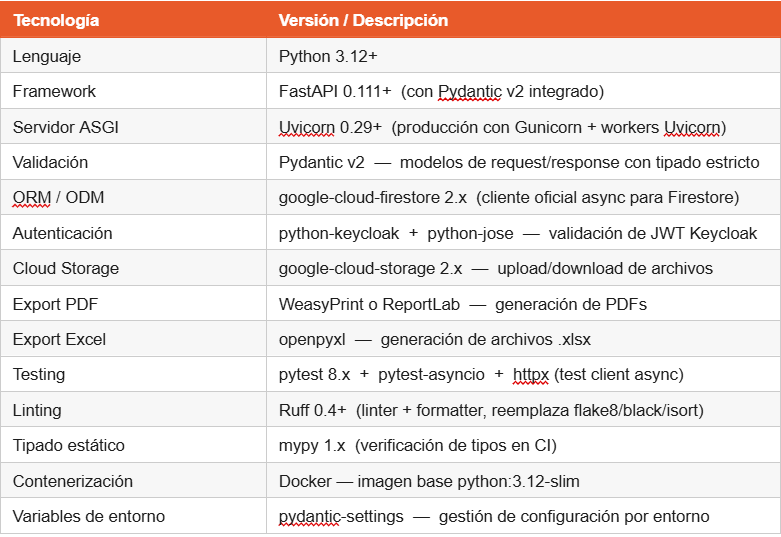

# Sistema de Gestión de riesgos en faenas

Sistema  integral para la gestión de riesgos en plantas industriales. Para contextualizar, existen muchos entornos de trabajo en que los trabajadores están expuestos a riesgos que puedan dañar su integridad, generalmente riesgos físicos. Pueden ser varios escenarios, como inundaciones, cortes de luz, incendios, derrame de químicos, incluso asaltos. Para poder registrar estos incidentes, lo que hace el trabajador que trabaja en esos entornos es registrar los hechos a mano. Es decir, los reportes que ellos elaboran lo realizan a papel, ya sea en blanco o con un formato de reporte otorgado por la empresa. Una vez hecho el reporte, el trabajador debe enviarlo a su correspondiente supervisor (presencialmente) para que éste pueda analizar el caso y resolverlo. 
¿Cuál es el problema con esto? Que todo este proceso consume tiempo, requiere logística y que la trazabilidad no es del todo seguro. Asimismo, el proceso descrito depende de objetos fisicos como los registros en papel, y no hay una base de datos que albergue dichos registros, y a la vez, consultar, actualizar, seleccionar o eliminar. Al haber dependencia de objetos físicos, ello requiere salvaguardarlos de una forma más engorrosa, y al acumularse con el tiempo, resulta más dificil consultar en un futuro un determinado reporte.

## Características Principales

### Módulos Funcionales <describir todos los módulos que componen la solución>

- **Reporte de Peligros de Seguridad**: Los trabajadores pueden reportar actos inseguros y condiciones inseguras mediante fotografías, ubicación geográfica y descripciones detalladas.

- **Seguimiento de Estado en Tiempo Real**: Permite monitorear el estado de un reporte durante todo su ciclo de vida (enviado → en revisión → acción asignada → cerrado).

- **Monitoreo de SLA**: Indicadores visuales que muestran si los reportes están dentro del plazo, en riesgo de incumplimiento o vencidos.

- **Estadísticas Personales de Seguridad**: Permite visualizar tasas de efectividad, rachas de participación y métricas relacionadas con el reporte de Incidentes y Actos Peligrosos (IAP).

- **Notificaciones**: Los usuarios reciben alertas en tiempo real sobre cambios en el estado de sus reportes y avisos de seguridad específicos de su área de trabajo.

- **Soporte Offline**: Los reportes se almacenan localmente cuando no hay conexión a Internet y se sincronizan automáticamente una vez que se restablece la conectividad.

### Funcionalidades Adicionales

- **Integración con IAP**: Gestión especializada para reportes de IAP (Incidentes y Actos Peligrosos u Oportunidades de Mejora, según la definición de la organización).
- **Acciones Correctivas**: Permite asignar, monitorear y dar seguimiento a acciones correctivas, incluyendo fechas límite y estado de cumplimiento.
- **Comentarios y Discusión**: Facilita la colaboración entre los miembros del equipo mediante comentarios asociados a cada reporte.
- **Clasificación Jerárquica de Reportes**: Los reportes pueden clasificarse como actos inseguros o condiciones inseguras para mejorar su análisis y tratamiento.
- **Soporte para Múltiples Turnos**: Permite registrar incidentes y observaciones correspondientes a turnos de mañana, tarde o noche.
- **Tema Industrial Oscuro**: Interfaz diseñada específicamente con una temática oscura y acentos en color naranja de seguridad, optimizando la visibilidad y la experiencia de uso en entornos industriales.

## Stack Tecnológico <detallar el stack tecnológico utilizado>

### Backend

- 
- 
- 
- 

### Frontend
- 
- 
- 

### Base de Datos
- 
- 
- 

## Modelos de Datos

El sistema incluye **## modelos** que cubren:

- 
- 
- 
- 
- 
- 

## Seguridad <describir las medidas y tecnologías de seguridad utilizadas, abajo ejemplos>

- Autenticación JWT con tokens seguros
- Hash de contraseñas con bcryptjs
- Middleware de autenticación y autorización
- Validación de roles (admin/consultor)
- CORS configurado
- Validación de datos con express-validator

## Integrantes

**CAPSTONE_001D - Grupo #**

- 
- 
- * 

## Documentación Adicional <especificar la documentación adicional que se incorpora, abajo son ejemplos>

- **ERS**
- **Diagrama de Clases**
- **Modelo de Datos**
- **Carta Gantt**

## Arquitectura <especificar la arquitectura de la solución, abajo son ejemplos>

El sistema sigue una **arquitectura en capas**:

- **Capa de Presentación**: Next.js con componentes React
- **Capa de Controladores**: Express routes y controllers
- **Capa de Servicios**: Lógica de negocio y validaciones
- **Capa de Datos**: Sequelize ORM con PostgreSQL
- **Capa de Auditoría**: Triggers de base de datos para trazabilidad

## Metodología <especificar la metodología de la solución, abajo son ejemplos>

El proyecto fue desarrollado siguiendo la **metodología Cascada (Waterfall)**, con fases bien definidas:

1. **Fase 1**: Planificación y Análisis
2. **Fase 2**: Diseño
3. **Fase 3**: Desarrollo
4. **Fase 4**: Pruebas y Despliegue
5. **Fase 5**: Cierre

## Licencia

Este proyecto fue desarrollado como parte del proyecto APT (Aplicación de Proyecto Tecnológico) para <nombre de la empresa>.

**Versión**: #####  
**Última actualización**: ########
